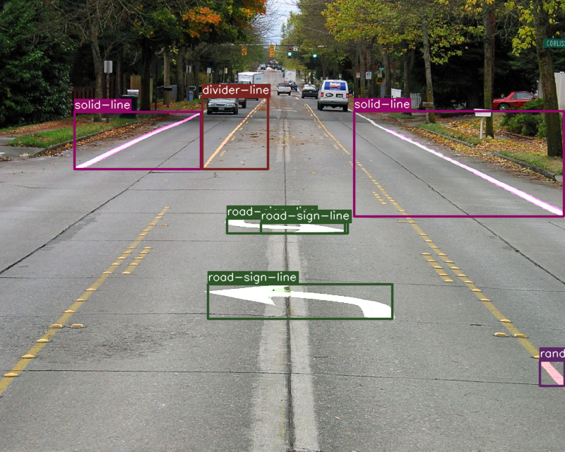

# multi-lane_detection

Датасет для обнаружения дорожной разметки можно выгрузить по [ссылке](https://disk.yandex.ru/d/LWrk8bdPNP3nzw). Данный датасет был частично изменен, исходный можно найти на [RoboFlow](https://universe.roboflow.com/bestgetsbetter/jpj)

Набор данных содержит 1021 обучающую выборку и 112 тестовых выборок .

Классы объектов:

- divider-line
- dotted-line
- double-line
- random-line
- road-sign-line
- solid-line

## Настройка виртуального окружения

Для начала рекомендуется настроить виртуальное окружение командой `python3.8 -m venv venv38` и активировать `source ./venv38/bin/activate`

## Установка пакетов

Для оценки используется `pycocotools`, который можно установить следующей командой

```zsh
pip install pycocotools 
```

Установка PyToch 2.0.0:

```zsh
pip install torch==2.0.0 torchvision==0.15.1 torchaudio==2.0.1
```
Установка OpenCV:

```
pip install opencv-python
```

```
pip install pyrealsense2
```

## Тестирование

Для запуска видео-теста можно воспользоваться командой:

```
python inference_video.py --weights outputs/training/road_line/model_15.pth --show --threshold 0.9 --input input/inference_data/video_3.mp4
```

Для запуска теста на изображениях можно воспользоваться командой:

```
python inference_image.py --weights outputs/training/road_line/model_15.pth --threshold 0.8 --input input/road_lane_instance_segmentation/val2017/ --show
```

В обоих тестах задаются аргументы:

- `--weights`: Путь к файлу весов, тут используются веса из эпохи 16.
- `--threshold`: порог преобразования.
- `--input`: задается путь до изображения или видео.
- `--show`: аргумент, отвечающий за `imshow` изображения или видео. 
- `--no-boxes`: дополнительный аргумент, отвечающий за отмену отрисовки коробки (Bounding box)  над объектами.

В процессе работы результат пишется в `outputs/inference`

<p align="center">

</p>